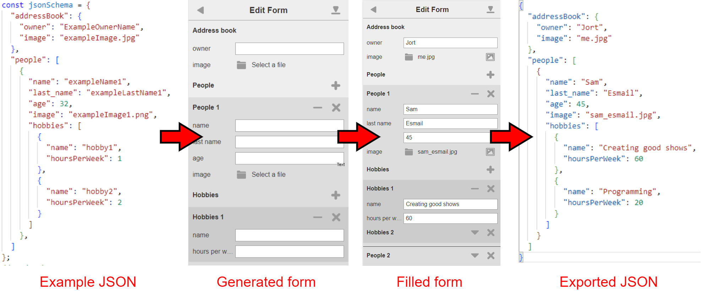

<!--   -->
<h1 align="center">JORTSON</h1>

JORTSON is a tool to dynamically generate forms based on an example JSON output file.  

Example: you have an address book application on your computer which allows importing new contacts.  
These contacts need to be supplied as a JSON file, which needs to be in a certain format. 
The application provides an example of this import JSON file.  

JORTSON takes that example JSON file, generates a form with it, and outputs the entered form data in the same format.

This is different from similiar solutions, like [jsonforms.io](https://jsonforms.io/), where you have to manually define, for each form entry, what kind of input is needed.

## Usage
Run `npm install`.  

Put the example JSON in `const jsonSchema` variable in [index.js](index.js).

Run `npm run build`. This will merge [index.css](index.css) and [index.js](index.js) files into [index.html](index.html), which will be called [JORTSON_form.html](dist/JORTSON_form.html), located in the [dist](dist) folder.

Open the generated form wherever you want.
Entered data is saved instantly in browser storage.  
When you are done entering the form, press the export button.
This downloads a .zip, which contains the filled in JSON file, images and the form schema.  

## Dynamic form generation 
Forms are generated recusively. This means you can have an object in an object in an object... etc.  
Note that not the full JSON specifiation is supported.  
JORTSON allows the following value types to be dynamically translated into forms: 
### string
`"key": "exampleString"` gets translated into a text field.

### number
`"key": 4.20` gets translated into a number field.
Works for both integers and doubles.
Adds a increment / decrement button on the field, and summons a number input keyboard on mobile.

### object
`"key": {}` gets translated into a section with the keyname as title.
Each key:value pair in the objects gets parsed according to these rules.

### array of objects
`"key": "[{}, {}, {}]"` gets translated into a list.
The objects are parsed as described above.
Adds a header with the keyname, with a plus button next to it, to add a new list item.
Each list item can be deleted or collapsed.

### image
`"image": "exampleImage.jpg"` gets translated into an image upload button.
Keys which equal 'image' or end with '_file' become image upload buttons.
Also shows a preview button, so users can see the uploaded image.

## Form manipulation
The following modifications can be made to the input JSON to modify the generated form:

### dropdown
`"key": ["option1", "option2", "option3"]` a key with an array of strings or numbers gets translated into a dropdown button.
The selected option is saved as a string.

## Limitations
The input JSON should satisfy the following requirements:
* property names cannot contain dot "." symbols
* property names cannot be numbers
* properties where the value is a file must be named "image" or "file" or end with "_file"
* properties must have a sample value of the correct type (file type is just a string)
* arrays must contain at least one sample object
* array objects in the same array must have the same property names
* array objects in the same array must have the same number of properties

## Development

Run `npm run dev` to start the development server.  
Open a browser and go to `http://localhost:5173` to see the generated form.  
Alternatively, use the live server plugin in VSCode.

If using a Chromium based browser, press F12 in the browser and in the top-right corner of devtools click on Toggle Device Toolbar which will show the page as though it's a mobile device.
The dimensions used for development were 360 x 640, which is the resolution of a Samsung Galaxy S5.

## Credits
Code base created by [James](james4171@hotmail.com). His work is contained in the `old` folder.  

The idea, documentation and code additions are by me :)
